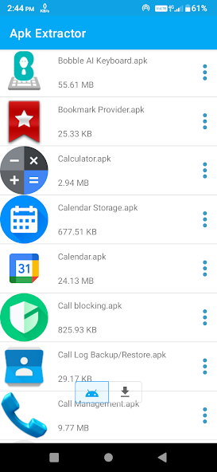
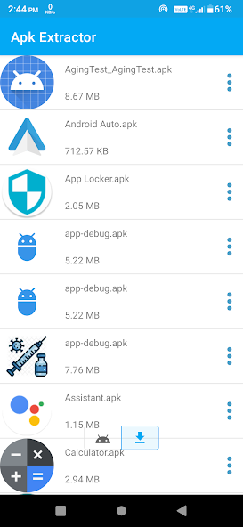
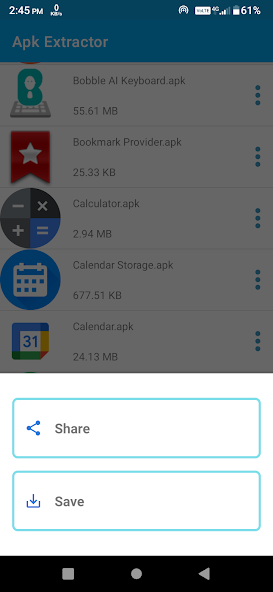

# APK Saver X 📦📲

**APK Saver X** is a fast, simple, and powerful Android utility app that allows you to **extract APK files from installed applications** on your device.  
The extracted APKs can be saved as a backup or shared with other devices for later installation.

**Alert** This app was developed and tested upto Android 10 and is not maintained currently, might not work on latest OSs.
---

## 📱 About APK Saver X

Welcome to **APK Save and Share**.

APK Saver X is an excellent tool for creating APK files from apps already installed on your Android device.  
Once extracted, APK files can be saved locally or shared to another device using multiple offline and online methods.

No root access is required — everything works safely on your device.

---

## ✨ Features

- ⚡ Fast and easy to use
- 📦 Extract APKs from **installed apps**
- 🧩 Supports **system applications**
- 🔓 **No ROOT access required**
- 💾 Default save path:  
  `/sdcard/Apk Extractor/`
- 📱 Compatible with **Android 10 and above**
- 📝 APK naming format:  
  `AppName_AppPackage_AppVersionName_AppVersionCode.apk`
- 📤 Share APKs directly from the app
- 🌙 Dark Mode support
- 🎨 Clean and beautiful UI

---

## 🔄 Send APKs to Another Device

### ✰ Without data cost
- Bluetooth

### ✰ As attachments through
- Email
- WhatsApp
- Google Drive
- Huawei Share

---

## 🔐 Privacy & Security

- ✅ No personal data collected
- ✅ No analytics or tracking
- ✅ All APK extraction happens locally on your device
- ✅ No internet connection required for extraction

Your apps and data remain completely private.

---

## 🚀 Use Cases

- Backup installed apps
- Share apps with friends or family
- Save APKs before uninstalling apps
- Install apps later without re-downloading
- Transfer apps between devices

---

## 🛠️ Tech Details

- Platform: Android
- Works without root
- Offline functionality
- Lightweight & efficient

---

## 🖼️ Screenshots

<!-- Add screenshots here -->

---

## 📧 Contact

For support, feedback, or suggestions:

**Developer:** DKTechHub  
📩 **Email:** kdurgesh2004ee@gmail.com

---

## 📄 License

All rights reserved © DKTechHub  
APK Saver X is provided for personal and educational use.
